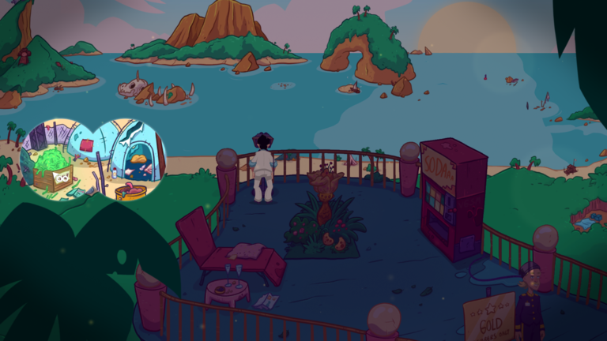
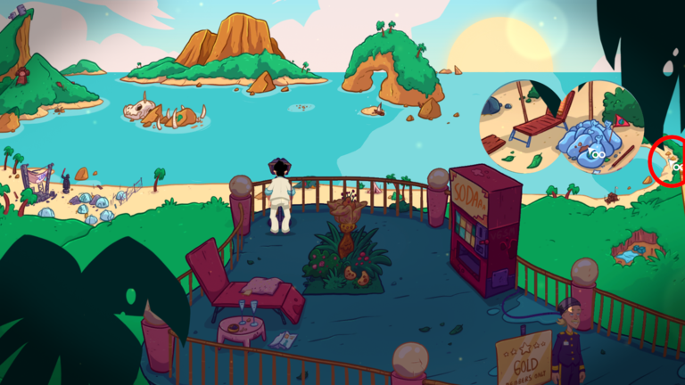
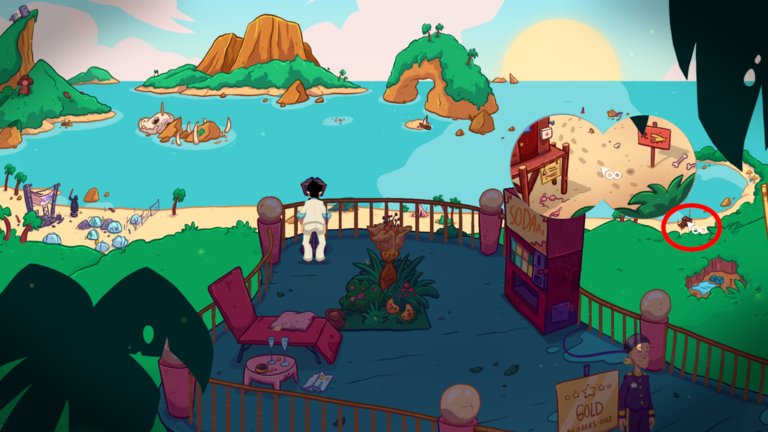
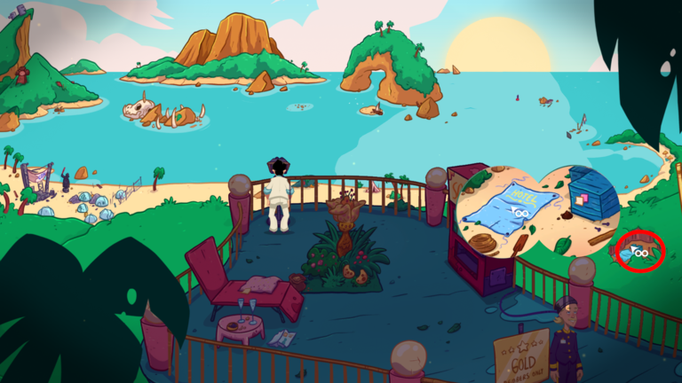
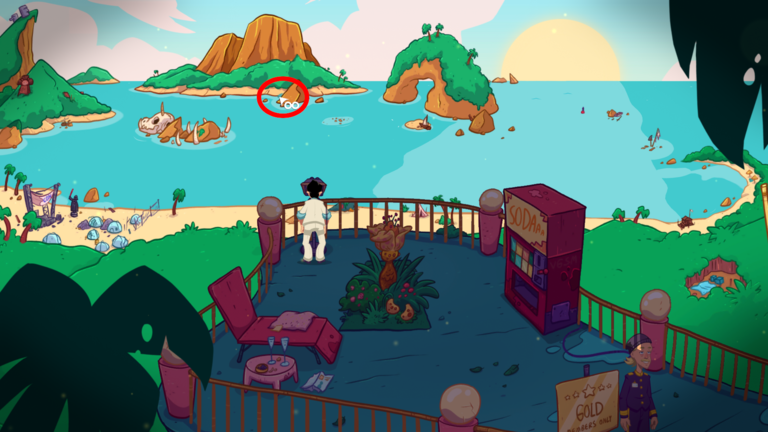

At [the observation deck](../020-observation-deck.md) every time you look through [the telescope](../030-dollar.md) Pi will ask if you know what happened to Faith. This guide will tell you how to know the answer to every step in Faith's actions.

Using the telescope is, literally, pixel hunt puzzle as you can't use the hotspots.

# Okay
Can we be sure Faith was here in Kalau'a? ^[ She had a room in the hotel. ]

# Easy
If she had a room how can we be sure it was her? ^[ Kip saw her. ]

# So, that is proven, now
But where did she spend her time?

No skinny dipping, no drinks at the pool bar, no time on the observation deck and not the buffet.

# What then?
Did you look closely in her room? There was a festival brochure in her bed. Take it, **read it**, and come back to the telescope. ^[ She was probably at that Galactic Festival. ]

# Done
Can you prove she was there?

Not the looks, not the stereotype view of all blonde women, not the feeling. Not even the flyer in her room prove that. Find the festival with the telescope.

# Where?
The festival is on the left. There is a box of glowsticks. Click on them.

# What next?
Find someone who attended the festival, also.

# Who?
Go talk to Shauni at the beach (next to the pool). Talk to her until you get a glowstick.
She saw Faith there at the festival and saw her leave to Crescent Cove.
Go check the telescope, again. You can now prove Faith was at the festival. ^[ Shauni saw her there. ]

# True!
But what happened after the festival? ^[ Faith went to Crescent Cove after the festival. ]

# Needs witnesses
Find the Crescent Cove with the telescope.

# Show me!

Look at the bags with oddly familiar world logo in them.

# I know!
Go talk to Emma about Crescent Cove. There's your eye witness. Ask about a woman. You have more hints now to solve the puzzle. ^[ She found the puck next to the lifeguard station. ]

# Closer
Where did she go from the lifeguard station?

Not to the hotel nor the beach to build a sand castle. She did not go back to Crescent Cove and she definitely is not back in New Lost Wages.

# Where?
Go check the lifeguard station with the telescope. Look at the footprints.

You now know where she went from the lifeguard station. ^[ Into the jungle. ]

# Right
Do we have any evidence? ^[ There was a print of the puck and footprints led into the jungle. ]

# We do!
Now, we are close to finding out where Faith is. You should now cross-examine Bobbi once more. 

# How?
To get more pressure against here spot the opening in the jungle and look at the tarp from the hotel.

# I know now
Go tell Bobbi that you know that Faith was in the jungle.

# She told about a boat!
A blue boat that she mentioned to Faith. Go find the boat with the telescope. And this, this is really a pixel hunt.

# Show me!

# Found it
You can now finish the piecing with Pi ^[ She took the boat to Muffington Island. ]. And [get out of this island](../200-leave-kalaua.md).
