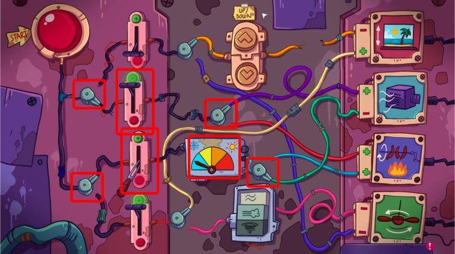

Lewis is having hard time with the air conditioning. Let's help him.

# How?
The air conditioning is controlled from the [electric panel](070-panel.md) at the buffet.

# Don't get it
You need to fix [the missing lever](075-lever.md).

# Did it
Then, put the levers and switches to these positions.

You can change if the air conditioning is in cooling or warming mode.
