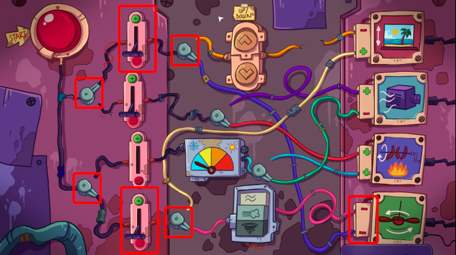

There is an interesting electric panel at the buffet room.

# How does it work?
Well, you click on the "start" button and it will send electricity through the wires. Then, with the levers you can change the parity (positive or negative) of the current. You have to match the parities in the plugs.

# Like?
For example to get the fan to spin you need to pull the top lever to negative and the bottom layer to negative. Then click the toggle switches so that the electricity goes to the fan control. Press start.

# There are some problems
 - [A lever is missing.](075-lever.md)
 - [The yellow wire is cut.](077-wire.md)
