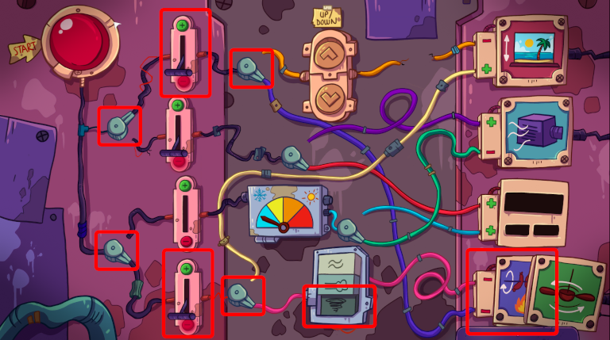

That poor pig. Free it!

# How?
Don't touch it. The spinning spit is controlled electrically.

# Where?
Use the electrical panel near the buffet.

# There it is!
Maybe that is the answer.

# How?
If you would make it spin, fast.

# Fast?
There is the speed control for the fan.

# But...
Did you try to touch the plugs?

# It comes off!
Click the spinning spit plug and then the fan plug. After that click the spinning spit again to move it into the fan socket.

# They're switched
Now, [use the panel](070-panel.md) to set the spinning spit to spin.

# How fast?
Always to the max! Select the bottom speed selection. Push the start button.

# Show me it

