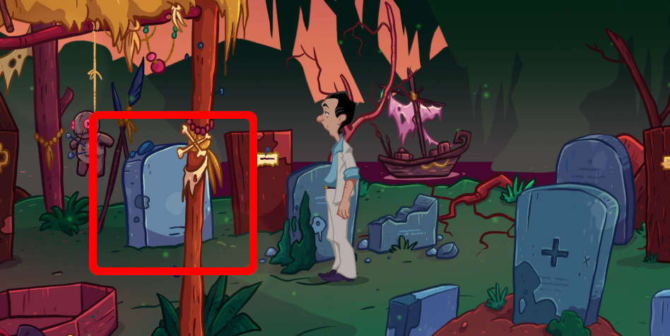

Visit the cemetery at [Muffington Island](../110-muffington-island/index.md).

# There are too many graves!
Every grave says something. Like a motto.

# And?
Did Regibald have a motto? ^[ Ask Bobbi! Ask if she can tell you anything about him. ]

# She told the motto
"If it moves, you can screw it!"

# Right
Find a grave with those words. ^[  It is the grave closest to the hut.  ]

# I found the grave
Read the grave again. Dig the grave up ^[ Use a shovel for digging. You can find a shovel from [the foot of the volcano](../120-kalaua-island/030-volcano/index.md). ]. There he rests.
