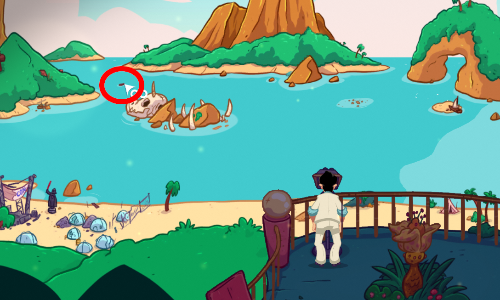
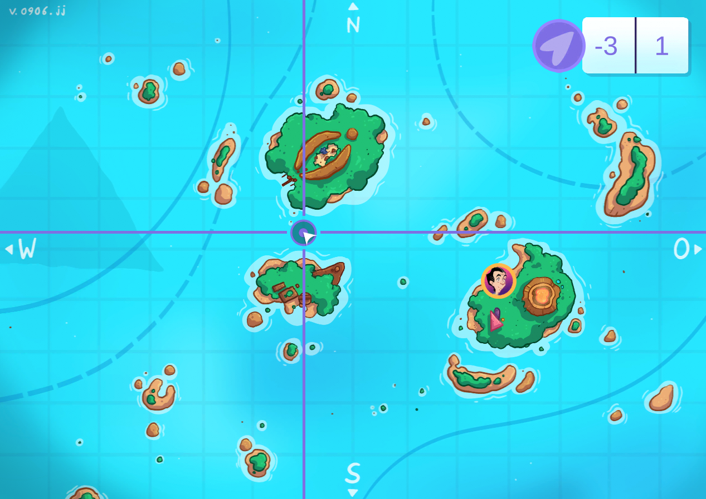

You tried to dig Lady Gobbledick's coffin up but the coffin fell into the ocean.

# Where is it?
You would have to spot it.

# With?
Use the telescope at the observation deck. Look for a small wooden object. Pixel hunt!

# Show me

It is exactly in he middle of Gofuku Island and Muffington Island.

# Set sail!
Go there to find the coffin.

# Show me where

