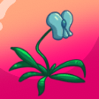

Dora wants you to bring her the only non-poisonous orchid in the archipelago.

# What is it?
Yeah, you should probably figure that out first.

# How?
Read the information brochure. It says something about the flora.

# So
Single blue flower and pointy leaves. Go find it.

# Where?
Unfortunately it switches places between games. You just have to look for it. And read the brochure. Otherwise it does not appear.

Here is a picture of it.

# Found it!
Give it to Dora.
