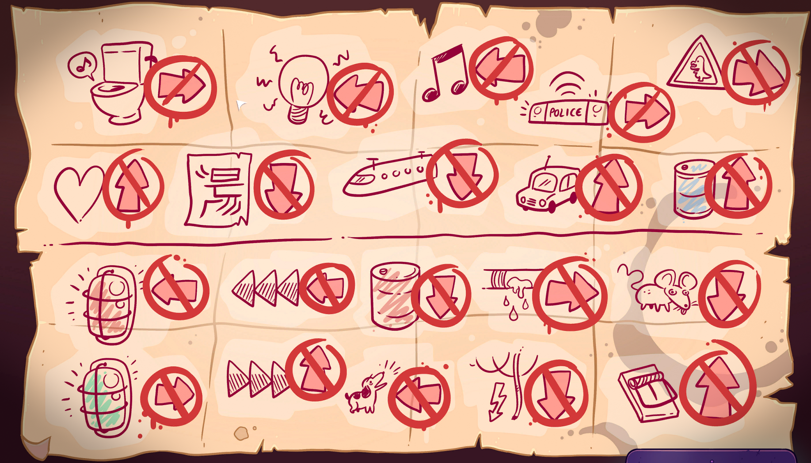

You should look at the note Nari gave to you. The objects in the room tell to which direction _not_ to move. Note that you can go back to the door you came into the room. As long as you come to new room you are doing fine. If you make a mistake, you are back at the cages.

Also note the color of the bins. The instructions only apply to blue and red bins. The yellow has no effect.

# Show me the note

# A room without any of these!
Go north. Where it says "Keep out". The door also has a sliding hole.
