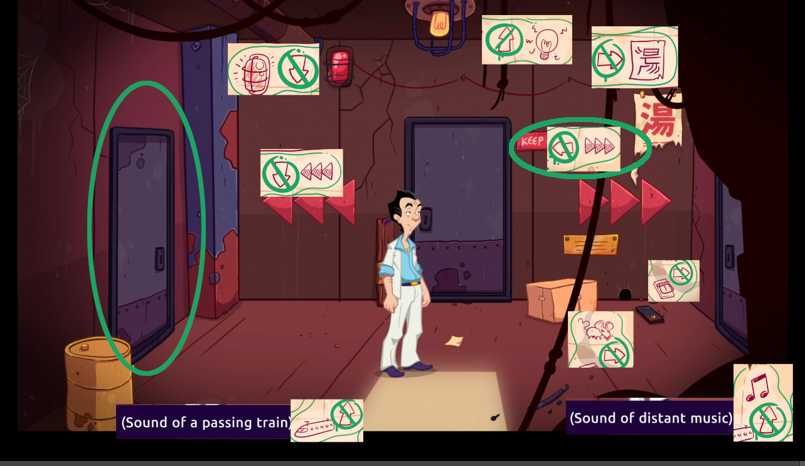

Lefty has correct instructions to find the Darknet from the labyrinth. He has dribbled something on Nari's papers.

# How to get instruction?
Give the note you got from Nari to Lefto.

# He changed it
Yes he did. It is a little easier now. Go to the labyrinth.

# Is it? I'm confused.
The logic is a little different from Nari's... or not that much.

# Tell me
Lefto tells you where _not_ to go. Count the hints and pick the direction that has least markings. The correct direction has only one marking.

# Show me an example

In this example there are three markings to not go _north_ (sound of distant music, sound of passing train and yellow light on the ceiling). There are three marking to not got _east_ (mouse hole, mouse trap, the chinese sign). There are two marking to not go _south_ (three arrows left, red light). But there is only one marking of not going _west_ (three arrows to right).

As there's only one marking to the left, the west door is the correct one in this room.

# Thanks! Show me the note

