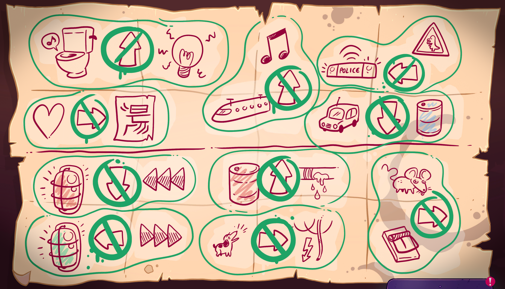

Lefty has correct instructions to find the Darknet from the labyrinth. He has dribbled something on Nari's papers.

# How to get instruction?
Give the note you got from Nari to Lefto.

# He changed it
Yes he did. It is a little easier now. Go to the labyrinth.

# Is it? I'm confused.
The logic is a little different from Nari's... or not that much.

# Tell me
You should count how many denies there are per direction. The direction with the least denies is the correct direction. There is actually only one deny in Lefty's notes for the correct direction. The wrong directions have multiple denies.

# Thanks! Show me the note

